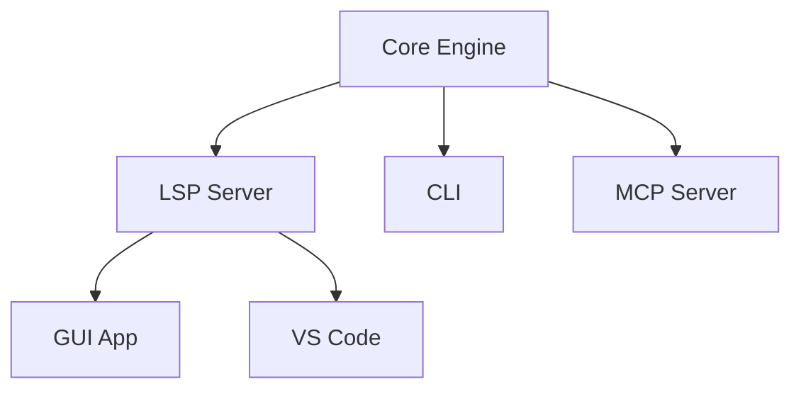
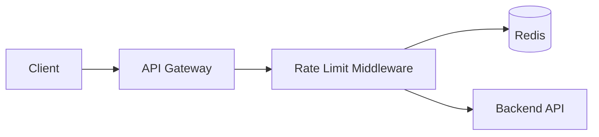

# Design: markdown-pal

> **Status:** Draft
> **Version:** V0001.0003.20250310T1730Z
> **Authors:** @human, @claude
> **Template:** design-doc
> **Home:** docs/design

## Problem

Design artifacts — specs, plans, runbooks, architecture docs — are central to working with Claude Desktop and Claude Code. These artifacts are Markdown files that flow back and forth between humans and AI agents in a review-and-refine loop.

There is no tool purpose-built for this workflow. Existing Markdown editors are designed for authoring, not for structured review. Agents operate on files with line-oriented tools like `sed` that have no understanding of document structure and break on special characters. The result is inefficient: entire documents get re-read for scoped changes, comments live outside the artifact in chat logs, and there's no shared model between human and agent for tracking what's been discussed, decided, or still open.

We need a **section-oriented editing and review tool** that supports both human and agent workflows over shared Markdown artifacts.

## Design Principles

1. **Valid Markdown everywhere.** Artifacts must render acceptably in any viewer — GitHub, VS Code, Claude. Use existing conventions (GFM admonitions, fenced code blocks) where they exist; define new admonition-style blocks where they don't. The app gives these richer treatment, but the file is never dependent on the app.

2. **Human-centric and agent-centric UX.** Two classes of interface to the same model: a native GUI app for humans, and CLI/MCP/LSP for agents and editors. Same operations, same document, different surfaces.

3. **Section-oriented.** The Markdown heading structure is the primary organizing unit. Comments anchor to sections. Edits target sections. The AST is the API. This is a deliberate rejection of line-oriented tools like `sed`, which require streaming entire documents and break on structured content.

4. **Token-efficient.** Agents should never need to read an entire file to do scoped work. Section-level reads, comments, and edits keep context windows small. Comments carry their own context so they're self-contained.

5. **Single-file artifacts in a version bundle.** Each revision of an artifact is a self-contained `.md` file with its metadata block. Revisions are collected in a `.mdpal` bundle directory that the OS presents as a single document. Version history is intrinsic, not dependent on git.

## Architecture

### Core Engine (Swift)

The heart of the system. Parses Markdown via `swift-markdown`, understands sections, manages comments, handles the YAML metadata block, manages the `.mdpal` bundle structure, knows about templates and document homes. Maintains an in-memory AST so operations are O(section) not O(document).

Key responsibilities:

- Markdown parsing and AST management
- Section-oriented CRUD (read, edit, create sections)
- Comment lifecycle (add, resolve, staleness detection)
- YAML metadata block read/write
- Bundle management (revisions, symlink, pruning)
- Template instantiation
- Document home discovery
- Section version hashing and optimistic concurrency

### LSP Server (Swift)

Wraps the core engine in the Language Server Protocol. This is the protocol layer that makes the engine accessible to any editor — including our own GUI app.

Provides:

- Diagnostics: stale comments, empty template sections, broken section references
- Navigation: go-to-section, section outline, comment jump-to-context
- Code actions: resolve comment, add question, refresh context
- Hover: show comment context, section version info
- Completions: admonition types, section slug references

Built on Apple's `LanguageServerProtocol` Swift package. Design informed by Marksman (F# Markdown LSP) but purpose-built for markdown-pal's comment and review semantics.

### GUI App (SwiftUI)

A native, multi-platform SwiftUI app (macOS, iPadOS, iOS). This is the primary human interface — not a generic editor that happens to have an LSP connection, but a purpose-built review tool that uses LSP as its backend protocol.

- `DocumentGroup`-based with `.mdpal` registered as a package UTType
- Side-by-side editor + live preview (macOS/iPad), toggleable on iPhone
- Section navigation sidebar
- Inline admonition rendering with interactive affordances
- Comment thread UI with resolution workflow
- Diff view for reviewing suggested edits (comparing revisions within the bundle)
- Template browser and document home navigation
- Version history browser showing all revisions in the bundle
- `swift-markdown` for parsing, `MarkdownUI` for preview rendering

The app speaks LSP to the core engine for document intelligence, but owns the UX for review workflows, comment interaction, and Claude integration affordances.

On macOS, Finder shows `.mdpal` bundles as single documents (right-click "Show Package Contents" to see revisions). On iOS/iPadOS, Files shows them as single documents via the package UTType declaration. The internal structure is invisible to the user unless they want to see it.

### CLI (`mdpal`)

A thin Swift command-line client. Talks to the core engine directly (standalone mode) or through the LSP server (when running). Designed for Claude Code to invoke and for scripting.

```
mdpal sections <bundle>                              # List sections with slugs
mdpal read <section-slug> <bundle>                   # Read section + version hash
mdpal edit <section-slug> --version <hash> <bundle>  # Edit section (stdin)
mdpal comment <section-slug> [options] <bundle>      # Add comment
mdpal comments [--all] <bundle>                      # List comments
mdpal resolve <comment-id> --response <text> <bundle>  # Resolve comment
mdpal create --template <n> --home <home> --name <n>  # New artifact bundle
mdpal refresh <section-slug> <bundle>                # Force context refresh
mdpal homes [--repo <path>]                          # List document homes
mdpal templates [--home <home>]                      # List available templates
mdpal version bump <bundle>                          # Bump version (resets revision)
mdpal version show <bundle>                          # Show current version id
mdpal history <bundle>                               # List all revisions in bundle
mdpal diff <rev1> <rev2> <bundle>                    # Diff two revisions
mdpal prune --keep <n> <bundle>                      # Prune old revisions
mdpal latest <prefix> [--home <home>]                # Resolve latest bundle for prefix
```

All commands that take `<bundle>` accept either the `.mdpal` directory path or just the prefix name (resolved via document home).

### MCP Server (V2)

Wraps the core engine as MCP tools for Claude Desktop and Claude Code. The MCP server holds the parsed AST in memory and maintains state across tool calls, so Claude never re-reads the full document.

Tools mirror the CLI surface. The MCP server can also push notifications when sections change (e.g., human edits in the GUI), enabling reactive agent workflows.

## Document Model

### Artifact Bundle

An artifact is a `.mdpal` directory that contains versioned revisions of a single document:

```
docs/design/MarkdownPalDesign.mdpal/
├── latest.md → V0001.0003.20250310T1628Z.md   (symlink)
├── V0001.0003.20250310T1628Z.md                (current)
├── V0001.0002.20250310T1422Z.md                (previous)
├── V0001.0001.20250310T1000Z.md                (earlier)
├── V0001.0000.20250310T0900Z.md                (first)
└── .mdpal/
    └── config.yaml                              (bundle config)
```

Each versioned `.md` file is self-contained: standard Markdown body plus a metadata block with comments and version info. Any single revision can be extracted from the bundle and it works as a standalone `.md` file anywhere.

The `latest.md` symlink always points to the current revision. This is the file the engine operates on. When a new revision is created (on save), a new versioned file is written and the symlink is updated.

The `.mdpal/config.yaml` stores bundle-level configuration that doesn't belong in individual revisions: document home association, template reference, prune policy, prompt recipes.

**Why a bundle:**

- **Keeps the document home clean.** `docs/design/` contains one entry per artifact, not a sprawl of versioned files.
- **Version history is intrinsic.** You don't need git to see how the artifact evolved. Every revision is right there, diffable with standard tools.
- **OS-native packaging.** macOS and iOS treat directories with package UTTypes as single documents. The user sees `MarkdownPalDesign.mdpal` as one thing in Finder/Files.
- **Agent-friendly.** Claude Code can `ls` inside the bundle to see all revisions, or follow `latest.md` for the current state. `mdpal history` gives a structured listing.
- **Comment resolution across revisions.** When a comment is resolved, the resolution appears in the *next* revision's metadata block. The old revision is a frozen snapshot. This gives you a natural audit trail — you can always see what the document looked like when a comment was made.

### Section

A heading and everything under it until the next heading of equal or higher level. The fundamental unit of all operations.

Sections are addressed by **slugs** derived from their heading text: `## Open Questions` becomes `open-questions`. Nested sections use path-style slugs: `document-model/comment-types` for `### Comment Types` under `## Document Model`.

If a heading changes, the slug changes. This is intentional — it forces comment re-anchoring rather than silently pointing at renamed content.

Each section carries a **version hash** computed from its content. This enables optimistic concurrency: an agent reads a section and gets the hash, then includes the hash when submitting an edit. If the section has changed, the operation is rejected and the current content + new hash is returned. No locks, no coordination, just compare-and-swap.

### Comment

Anchored to a section (with optional text sub-range within the section). Has a type, author, timestamp, section version hash, and — critically — a **context field** containing the exact text the comment was written against.

The context field serves three purposes:

- **Token efficiency**: reading a comment gives you the relevant content without separately reading the section
- **Staleness detection**: diff the context against current section content to determine if the comment is still relevant
- **Portability**: a comment is self-contained and understandable in isolation, enabling cross-artifact comment views

Comment types:

| Type | Intent | Expected Response |
|------|--------|-------------------|
| `question` | Ask for information or clarification | A textual answer |
| `suggestion` | Propose a change | Accept/reject/modify |
| `note` | Informational annotation | None required |
| `directive` | Instruction to act | Execution + confirmation |
| `decision` | Record a resolved choice | None (archival) |

Comments have two states: **unresolved** and **resolved**. When a comment is resolved, the resolution appears in the **next revision** of the artifact. The revision where the comment was originally created retains it as unresolved — that revision is a frozen snapshot. This gives a natural audit trail: you can always see what the document looked like when a comment was made, and when/how it was addressed.

### Comment Resolution Across Revisions

The lifecycle of a comment within the bundle:

1. **Revision N**: Comment `c001` is added as unresolved. The metadata block in `V0001.000N...md` contains it under `unresolved:`.
2. **Revision N+1**: The comment is resolved. The metadata block in `V0001.000(N+1)...md` contains it under `resolved:` with the response text, date, and resolver.
3. **Pruning**: When old revisions are pruned, the resolved comment history is preserved in the current revision's metadata block. The audit trail survives pruning.

This model means each revision is a complete, self-contained snapshot. You never need to read multiple revisions to understand the current state — `latest.md` has everything.

### Versioning

Artifacts carry a **version-revision-timestamp** identifier that serves both human (UX) and agent (AX) needs.

**Format:** `V{NNNN}.{NNNN}.{YYYYMMDD}T{HHMM}Z`

Example: `V0001.0003.20250310T1628Z`

Components:

- **Version** (4 digits, zero-padded): Major iteration number, bumped explicitly by a human when a meaningful milestone is reached (e.g., "completed full review cycle," "approved for implementation"). This is always a deliberate human decision — agents do not bump versions.
- **Revision** (4 digits, zero-padded): Auto-incremented on every save. Tracks mechanical changes between version milestones. Both humans and agents trigger revisions.
- **Timestamp**: ISO 8601 compact datetime in UTC. Records when this version-revision was created.

**Why this format:**

For **agents (AX)**: Fixed-width, zero-padded, lexicographically sortable. An agent can compare two version strings with a simple string comparison. It can extract components with a predictable split on `.` — no parsing ambiguity. The UTC timestamp eliminates timezone confusion across distributed workflows.

For **humans (UX)**: Reads naturally once the pattern is learned — "version 1, revision 3, March 10th at 4:28 PM UTC." The leading zeros signal "this is a structured system" which is appropriate for a tool built for design workflows. The full timestamp in the identifier means you never need to check file metadata to know when something was written.

**For both**: A single canonical string appears everywhere — in the front matter, in the revision filename, in the metadata block, in CLI output. No divergence between "display version" and "real version." What a human reads is exactly what an agent parses.

Version bumps are explicit actions — via the app's UI or `mdpal version bump <bundle>`. Revisions increment automatically on save. This means you can distinguish "polished through three review cycles" (V0003.0001) from "just created and auto-saved a few times" (V0001.0008).

The metadata block carries the same value:

```yaml
document:
  version_id: "V0001.0003.20250310T1628Z"
  version: 1
  revision: 3
  timestamp: 2025-03-10T16:28:00Z
```

### Revision Pruning

Over time, a bundle accumulates revisions. Not all need to be kept. The engine supports pruning old revisions while preserving the comment history.

`mdpal prune --keep 10 MarkdownPalDesign.mdpal` retains the 10 most recent revisions and deletes the rest. Before deleting, any resolved comment history from pruned revisions that isn't already in the current revision's metadata is merged forward.

Prune policy can be configured per-bundle in `.mdpal/config.yaml`:

```yaml
prune:
  keep: 20
  auto: true  # prune automatically when revision count exceeds keep
```

### Bundle Configuration

The `.mdpal/config.yaml` file inside the bundle stores per-artifact configuration:

```yaml
name: MarkdownPalDesign
template: design-doc
home: docs/design
prune:
  keep: 20
  auto: true
```

This is metadata about the *bundle* rather than about any individual revision. Individual revision metadata (version, comments, authors) lives in each `.md` file's metadata block.

### Template

A skeleton `.md` file defining expected sections and optional prompt hints. Lives in `.markdown-pal/templates/`. Templates use `[!DIRECTIVE]` admonition blocks to provide guidance for whoever fills in each section — human or Claude.

Templates define:

- Expected sections (as headings)
- Placeholder content and prompt hints
- Front-matter metadata (type, description, default home)

When creating an artifact from a template, the engine creates a new `.mdpal` bundle, generates the initial `.md` revision from the template, and sets up the bundle config.

### Document Home

A path mapping that tells the app, CLI, and agents where artifacts of a given type live in a repository. Configured in `.markdown-pal/homes.yaml` at the repo root.

Homes associate:

- A name and description
- A filesystem path (relative to repo root)
- A list of applicable templates

```yaml
homes:
  design:
    path: docs/design
    templates: [design-doc, architecture-doc]
    description: Design documents and specs

  runbooks:
    path: docs/ops
    templates: [runbook]
    description: Operational runbooks
```

Within a document home, each artifact is a `.mdpal` bundle:

```
docs/design/
├── MarkdownPalDesign.mdpal/
├── AuthFlowDesign.mdpal/
└── ApiRateLimiting.mdpal/
```

Clean, scannable, one entry per artifact for both humans and agents.

## Designing for UX and AX

A core principle of markdown-pal is that every feature must work well for both humans (UX) and agents (AX). This is not "design for humans, then adapt for agents" or vice versa — it's simultaneous design for both audiences from the start.

**What this means in practice:**

Every piece of information has **one canonical representation** that both audiences consume. There is no "human-friendly display" that diverges from the "machine-parseable storage." The version string `V0001.0003.20250310T1628Z` appears identically in the front matter a human reads, the revision filename inside the bundle, the metadata block an agent parses, and the CLI output an agent processes. This eliminates an entire class of bugs where display and storage drift apart.

**Operations are symmetric.** Anything a human can do in the GUI, an agent can do via CLI or MCP. Add a comment, resolve a question, bump a version, create from template — same operations, same effects, different surfaces. The document model doesn't know or care who's operating on it.

**Affordances differ, semantics don't.** The GUI shows a comment as a card with an icon, a type badge, expand/collapse for context, and a "Resolve" button. The CLI shows the same comment as structured text with the same fields. The MCP tool returns it as a structured object. The underlying data is identical — only the presentation adapts to the audience.

**Discoverability is built into the format.** Bundle naming, section slugs, document homes, version strings — all are designed so that both a human browsing in Finder and an agent doing `ls` can orient themselves without additional tools or documentation. The format *is* the documentation.

**The bundle is the bridge.** On macOS, a human sees `MarkdownPalDesign.mdpal` as a single document in Finder. An agent sees it as a directory and can `ls` inside to find revisions, `cat latest.md` to read the current state, or `mdpal history` for a structured listing. Same artifact, different lenses, both natural for their audience.

**Token efficiency is a UX concern too.** When an agent reads only the section it needs, the human benefits because Claude's response is faster and more focused. When comments carry their own context, both the human reviewer and the agent reviewer can understand them in isolation. Efficiency and usability are aligned, not competing.

## Section-Oriented Editing: Rationale

The choice to build a section-oriented editor — rather than using line-oriented tools — is a core architectural decision. The rationale:

**Line-oriented tools fail on structured content.** `sed` requires streaming the entire document for any operation. Its delimiter-based syntax breaks when content contains slashes, pipes, brackets, or other special characters. Inserting a comment with `sed` is a minefield of escaping. This was demonstrated concretely during prototyping: a simple comment insertion failed because the comment text contained slashes that conflicted with `sed`'s delimiters.

**Section-oriented operations match how humans and agents think.** Nobody says "edit line 47." They say "update the Authentication section" or "add a question about Error Handling." The tool should operate at the same level of abstraction as the intent.

**The AST enables intelligent operations.** With a parsed AST, the engine can: skip headings inside fenced code blocks, detect section boundaries accurately, anchor comments to structural elements that survive edits, and compute meaningful version hashes. None of this is possible with line-oriented tools.

**Token efficiency requires structure awareness.** An agent reading "just the Authentication section" needs the engine to know where that section starts and ends. Line-oriented tools can only give you "lines 47-83" which is fragile and semantically meaningless.

## Token Efficiency Model

A key design goal is minimizing token consumption in agent workflows. The architecture achieves this through:

1. **Section-scoped reads**: agents request specific sections, not entire documents
2. **Self-contained comments**: the context field means reading a comment doesn't require also reading its section
3. **Version-gated edits**: conflicts return the current content, so the agent gets a "free" refresh without a separate read
4. **In-memory AST** (MCP server): the document is parsed once, subsequent operations don't re-read the file
5. **Structured metadata**: agents can read just the comment list without parsing the document body
6. **Staleness detection**: agents know whether their context is current without re-reading, and can selectively refresh only stale sections
7. **Bundle-level discovery**: `ls` on a document home shows all artifacts without opening any files; `latest.md` symlinks avoid scanning revision listings

## Implementation Roadmap

### V1 — Core Engine + Editor UX + CLI

**Core engine:**

- Markdown parsing via `swift-markdown`
- Section model with slug-based addressing
- Comment CRUD with context capture
- Comment resolution across revisions
- YAML metadata block read/write
- `.mdpal` bundle management (create, revision, symlink, prune)
- Section version hashing
- Artifact versioning (V{NNNN}.{NNNN}.{timestamp}) with auto-revision
- Template instantiation
- Document home discovery

**GUI app:**

- SwiftUI multi-platform app with `DocumentGroup` and package UTType for `.mdpal`
- Side-by-side editor + live preview (macOS/iPad), toggle on iPhone
- Section navigation
- Inline admonition rendering
- Comment display and basic resolution workflow
- Template browser and creation from template
- Document home navigation
- Version history browser within bundle
- Diff between revisions

**CLI:**

- `mdpal` command-line tool
- All core commands: sections, read, edit, comment, comments, resolve, create, refresh, homes, templates, version, latest, history, diff, prune

**LSP foundation:**

- Engine designed as a server from day one
- GUI app connects to engine via LSP (even if protocol compliance is partial)
- Section outline, diagnostics for stale comments, basic navigation

**Swift packages:**

- `apple/swift-markdown` — parsing and AST
- `markiv/MarkdownUI` — SwiftUI preview rendering
- `LanguageServerProtocol` — LSP implementation
- `Yams` or `swift-yaml` — YAML metadata parsing

### V2 — Agent Integration + Review Workflow

- MCP server wrapping the core engine
- Full LSP compliance (VS Code gets the experience)
- Interactive comment threads in the GUI
- Prompt packaging: construct token-efficient payloads from section + comments
- Richer admonition rendering (collapsible threads, status badges)
- Prompt templates: configurable per-project prompt recipes

### V3 — Collaboration + Advanced Workflows

- Push notifications on section changes (MCP → agent)
- Cross-artifact comment views ("all open questions across this home")
- Claude Notes: log of prompts used per artifact
- Export comments as Markdown or JSON
- Prompt recipe library and sharing
- Advanced template features (inheritance, conditional sections)

## Open Questions

> [!QUESTION] @human
> Should templates support inheritance? E.g., a base "document" template that "design-doc" extends?

> [!QUESTION] @human
> How do we handle images and other embedded assets? Should they live inside the `.mdpal` bundle alongside revisions?

> [!QUESTION] @human
> What's the right granularity for section slugs when headings contain code or special characters?

> [!QUESTION] @human
> Should the LSP server run as a persistent daemon, or launch on demand when the app or CLI starts?

> [!QUESTION] @human
> What's the minimum Swift version and macOS/iOS deployment target?

> [!QUESTION] @human
> Should the bundle support branching? E.g., two people working on different revision streams that get merged. Or is that overkill for V1 — just use git for that?

---

## Appendix A: File Format Specification

### Overview

A markdown-pal artifact is a `.mdpal` bundle (directory) containing versioned revisions of a single document. Each revision is a self-contained UTF-8 encoded `.md` file with a standard Markdown body and an optional metadata block. The bundle is registered as a package UTType so the OS presents it as a single document.

### Bundle Structure

```
{ArtifactName}.mdpal/
├── latest.md → {VersionId}.md          (symlink to current)
├── {VersionId}.md                       (current revision)
├── {VersionId}.md                       (previous revisions...)
└── .mdpal/
    └── config.yaml                      (bundle configuration)
```

Version ID format: `V{NNNN}.{NNNN}.{YYYYMMDD}T{HHMM}Z`

### Bundle Configuration (`.mdpal/config.yaml`)

```yaml
name: MarkdownPalDesign
template: design-doc
home: docs/design
prune:
  keep: 20
  auto: true
```

### Revision File (`.md`)

Each revision file contains a standard Markdown document body followed by a metadata block:

````
<!-- begin:markdown-pal-meta
```yaml
document:
  version_id: "V0001.0003.20250310T1628Z"
  version: 1
  revision: 3
  timestamp: 2025-03-10T16:28:00Z
  created: 2025-03-10
  authors: [human, claude]

unresolved:
  - id: "c001"
    type: question
    author: claude
    section: authentication
    version: a3f2b1
    date: 2025-03-10
    context: |
      The user authenticates via OAuth2 and receives
      a bearer token that expires after 24 hours.
    text: "Does this handle token refresh?"

resolved:
  - id: "c002"
    type: question
    author: human
    section: architecture
    version: f1a2b3
    date: 2025-03-09
    context: |
      All metadata lives in sidecar files alongside
      the main .md artifact.
    text: "Should we use sidecar files?"
    response: >
      No. Single file with metadata block at end of
      document. Avoids sync issues.
    resolved_date: 2025-03-10
    resolved_by: human
```
end:markdown-pal-meta -->
````

### Metadata Block Schema

**`document`** (required): Artifact-level metadata.

- `version_id`: Full version identifier string (`V{NNNN}.{NNNN}.{YYYYMMDD}T{HHMM}Z`)
- `version`: Major version number (integer, bumped explicitly by human)
- `revision`: Revision number (integer, auto-incremented on save)
- `timestamp`: ISO 8601 datetime of this version-revision (UTC)
- `created`: Creation date (ISO 8601)
- `authors`: List of author identifiers

**`unresolved`**: List of open comment objects.

**`resolved`**: List of resolved comment objects.

### Comment Object Schema

Required fields:

- `id`: Unique identifier string (e.g., "c001"). Assigned by the engine.
- `type`: One of `question`, `suggestion`, `note`, `directive`, `decision`
- `author`: Identifier string (e.g., "claude", "human", a username)
- `section`: Section slug the comment is anchored to
- `version`: Section version hash at time of comment creation
- `date`: Date comment was created (ISO 8601)
- `context`: The exact text content from the section at time of comment creation. Used for staleness detection and self-contained readability.
- `text`: The comment content

Additional fields for resolved comments:

- `response`: Resolution text
- `resolved_date`: Date resolved (ISO 8601)
- `resolved_by`: Identifier of who resolved it

Optional fields:

- `subrange`: Text substring within the section for finer-grained anchoring. If present, should appear within `context`.
- `priority`: `low`, `normal`, `high`
- `tags`: List of free-form tag strings

### Section Slug Convention

Section slugs are derived from heading text by:

1. Stripping Markdown formatting (bold, italic, code spans)
2. Converting to lowercase
3. Replacing spaces and special characters with hyphens
4. Collapsing consecutive hyphens
5. Trimming leading/trailing hyphens

Nested sections use path-style addressing: `parent-slug/child-slug`.

Examples:

| Heading | Slug |
|---------|------|
| `## Open Questions` | `open-questions` |
| `## CLI Design (\`mdpal\`)` | `cli-design-mdpal` |
| `### Comment Types` (under `## Document Model`) | `document-model/comment-types` |

### Version Hash

A section's version hash is computed by:

1. Extracting the section's raw Markdown content (heading through end of section)
2. Computing a truncated hash (first 6 hex characters of SHA-256)

The hash changes when any content in the section changes, including whitespace. This is intentional — it ensures agents always work against exactly the content they read.

---

## Appendix B: Markdown Extensions

### Philosophy

markdown-pal extends Markdown through conventions that are **valid Markdown** and **render harmlessly** in any standard viewer. The app gives these conventions richer interactive treatment, but the file never depends on the app.

All extensions are based on existing GitHub Flavored Markdown patterns (admonition blockquotes, fenced code blocks, HTML comments) rather than inventing new syntax.

### Inline Admonitions

Based on GitHub's alert/admonition syntax. Used for structured interactions within the document body.

#### Question

Asks for information or clarification. Expects a textual response.

```markdown
> [!QUESTION] @claude
> Does this authentication flow handle token refresh correctly?
> What happens when a token expires mid-session?
```

The `@target` indicates who the question is directed at. Optional — if omitted, the question is open to anyone.

#### Suggestion

Proposes a change. Expects accept/reject/modify.

```markdown
> [!SUGGESTION] @human
> Consider splitting this into two sections — one for the happy path,
> one for error handling. This would make the spec easier to review
> incrementally.
```

#### Note

Informational annotation. No response required.

```markdown
> [!NOTE]
> This section was last reviewed on 2025-03-08 and may be
> out of date with the latest API changes.
```

#### Directive

Instruction to act. Expects execution and confirmation.

```markdown
> [!DIRECTIVE] @claude
> Expand this section with concrete examples of each error code
> and the expected client behavior for each.
```

#### Decision

Records a resolved choice. Used to capture decisions inline where they were made.

```markdown
> [!DECISION]
> We will use YAML inside the metadata block rather than pipe-delimited format.
> YAML handles multiline content and special characters natively, and both
> humans and Claude read/write it fluently.
> Decided: 2025-03-10, by @human and @claude.
```

### Admonition Rendering

In any standard Markdown viewer, admonitions render as blockquotes — readable and unobtrusive. In the markdown-pal app:

- `[!QUESTION]` blocks display with a question icon, a response input affordance, and status (answered/unanswered)
- `[!SUGGESTION]` blocks display with accept/reject/modify actions
- `[!NOTE]` blocks display with an info icon
- `[!DIRECTIVE]` blocks display with a task icon and completion status
- `[!DECISION]` blocks display with a checkmark icon and are visually distinct as settled

### Diagrams

Mermaid diagrams in fenced code blocks are supported and rendered visually in the app:

````markdown

````

This renders as a code block in standard viewers and as an interactive diagram in the app. No custom syntax — this is already a widely adopted convention.

### Template Placeholders

In template files, placeholder tokens indicate content to be filled in:

```markdown
# {title}

> **Status:** Draft
> **Version:** {version_id}
> **Authors:** {authors}
> **Template:** {template}
> **Home:** {home}
```

Placeholders use `{name}` syntax. They are replaced when an artifact is created from the template. In a standard viewer they render as literal text, which is acceptable for template files.

### Front Matter (Optional)

Artifacts may include YAML front matter for compatibility with static site generators and other tools:

```markdown
---
title: Authentication Design
template: design-doc
home: docs/design
---
```

The app reads front matter if present but does not require it. The canonical metadata location is the metadata block at the end of the file. If both exist, the metadata block takes precedence.

---

## Appendix C: Example Artifact

The following is a complete example showing a `.mdpal` bundle on disk and the contents of its current revision. This represents a fictional API design document partway through a review cycle between a human author and Claude.

### Bundle on disk

```
docs/design/ApiRateLimiting.mdpal/
├── latest.md → V0001.0002.20250308T1422Z.md
├── V0001.0002.20250308T1422Z.md
├── V0001.0001.20250306T0900Z.md
├── V0001.0000.20250304T1000Z.md
└── .mdpal/
    └── config.yaml
```

`.mdpal/config.yaml`:
```yaml
name: ApiRateLimiting
template: design-doc
home: docs/design
prune:
  keep: 20
  auto: true
```

### Contents of `latest.md` (V0001.0002.20250308T1422Z.md)

````markdown
# API Rate Limiting Design

> **Status:** In Review
> **Version:** V0001.0002.20250308T1422Z
> **Authors:** @alice, @claude
> **Template:** design-doc
> **Home:** docs/design

## Problem

Our API currently has no rate limiting. During the Black Friday traffic spike,
a single misconfigured client sent 50,000 requests per minute, degrading
service for all users. We need a rate limiting strategy that protects the
platform without penalizing well-behaved clients.

> [!NOTE]
> Incident report for the Black Friday event is in docs/ops/incident-2024-11-29.md.

## Design Principles

1. **Transparent limits.** Clients should always know their current quota, remaining
   requests, and reset time via response headers.
2. **Graduated response.** Warn before blocking. Use 429 responses with Retry-After.
3. **Per-tenant fairness.** Rate limits apply per API key, not globally.

> [!DECISION]
> We will use a sliding window algorithm rather than fixed window.
> Fixed windows allow burst traffic at window boundaries.
> Decided: 2025-03-05, by @alice and @bob.

## Architecture

Rate limiting will be implemented as middleware in the API gateway, backed by
Redis for distributed counter storage.



The middleware checks the counter before forwarding requests. If the limit is
exceeded, it returns 429 immediately without touching the backend.

> [!QUESTION] @claude
> Should we use a single Redis instance or a Redis Cluster for the rate
> limit counters? What are the trade-offs for our expected scale of
> ~10,000 requests/second?

> [!SUGGESTION] @alice
> Consider adding a local in-process cache (e.g., a token bucket) as a
> first layer before hitting Redis. This would reduce Redis load significantly
> for clients that are clearly within limits.

## Rate Limit Tiers

| Tier | Requests/min | Burst | Use Case |
|------|-------------|-------|----------|
| Free | 60 | 10 | Evaluation and development |
| Standard | 600 | 100 | Production applications |
| Enterprise | 6,000 | 1,000 | High-volume integrations |

> [!DIRECTIVE] @claude
> Add a section describing how clients can request tier upgrades
> and what the approval process looks like.

## Response Headers

All API responses include rate limit headers:

- `X-RateLimit-Limit`: Maximum requests per window
- `X-RateLimit-Remaining`: Requests remaining in current window
- `X-RateLimit-Reset`: Unix timestamp when the window resets
- `Retry-After`: Seconds until the client should retry (only on 429)

## Open Questions

> [!QUESTION] @alice
> How do we handle rate limits for webhooks? They're server-to-server
> and don't have the same client-facing UX for communicating limits.

> [!QUESTION] @alice
> Should rate limits be configurable per-endpoint, or only per-tier?
> Some endpoints (like search) are more expensive than others.

<!-- begin:markdown-pal-meta
```yaml
document:
  version_id: "V0001.0002.20250308T1422Z"
  version: 1
  revision: 2
  timestamp: 2025-03-08T14:22:00Z
  created: 2025-03-04
  authors: [alice, claude]

unresolved:
  - id: "c001"
    type: question
    author: claude
    section: architecture
    version: d4e5f6
    date: 2025-03-07
    context: |
      Rate limiting will be implemented as middleware in the API gateway,
      backed by Redis for distributed counter storage.
    text: >
      Should we use a single Redis instance or a Redis Cluster for the
      rate limit counters? What are the trade-offs for our expected
      scale of ~10,000 requests/second?

  - id: "c002"
    type: suggestion
    author: alice
    section: architecture
    version: d4e5f6
    date: 2025-03-08
    context: |
      The middleware checks the counter before forwarding requests.
    text: >
      Consider adding a local in-process cache (e.g., a token bucket)
      as a first layer before hitting Redis. This would reduce Redis
      load significantly for clients that are clearly within limits.

  - id: "c003"
    type: directive
    author: alice
    section: rate-limit-tiers
    version: a1b2c3
    date: 2025-03-08
    context: |
      | Tier | Requests/min | Burst | Use Case |
      | Free | 60 | 10 | Evaluation and development |
      | Standard | 600 | 100 | Production applications |
      | Enterprise | 6,000 | 1,000 | High-volume integrations |
    text: >
      Add a section describing how clients can request tier upgrades
      and what the approval process looks like.

resolved:
  - id: "c006"
    type: question
    author: claude
    section: design-principles
    version: b3c4d5
    date: 2025-03-05
    context: |
      Considering fixed window vs sliding window algorithms.
    text: "Fixed window or sliding window for rate limiting?"
    response: >
      Sliding window. Fixed windows allow burst traffic at window
      boundaries. Decision recorded inline as [!DECISION].
    resolved_date: 2025-03-05
    resolved_by: alice

  - id: "c007"
    type: suggestion
    author: claude
    section: problem
    version: a1a1a1
    date: 2025-03-04
    context: |
      Our API currently has no rate limiting.
    text: >
      Add a reference to the Black Friday incident report
      for context.
    response: "Added as a [!NOTE] admonition under the problem section."
    resolved_date: 2025-03-06
    resolved_by: alice
```
end:markdown-pal-meta -->
````

### What This Example Demonstrates

This example shows all markdown-pal features working together:

- **Bundle structure**: three revisions on disk, `latest.md` symlink, `.mdpal/config.yaml`
- **Front matter** with version identifier (`V0001.0002.20250308T1422Z`) — fixed-width, sortable, readable by both humans and agents
- **Inline admonitions** in context: `[!NOTE]` for references, `[!DECISION]` for captured choices, `[!QUESTION]` and `[!SUGGESTION]` for active review threads, `[!DIRECTIVE]` for action items
- **`@target` addressing** on questions and directives
- **Mermaid diagram** embedded in the architecture section
- **Metadata block** with YAML containing both unresolved and resolved comments
- **Context fields** on every comment capturing the text they were written against
- **Section slugs** used as anchors (`architecture`, `rate-limit-tiers`, `design-principles`)
- **Version hashes** on each comment for staleness detection
- **Bi-directional authorship**: both @alice (human) and @claude author comments
- **Comment resolution across revisions**: c006 and c007 were unresolved in V0001.0001, resolved in V0001.0002
- **UX/AX symmetry**: every piece of information is in one canonical format consumable by both humans and agents

---

## Appendix D: Review Prototype

A React component prototype of the agent review workflow is available as `review-prototype.jsx`. It sends a markdown-pal artifact to the Claude API and requests structured review comments in the standard YAML format. This demonstrates the agent-as-reviewer pattern: structured prompts in, structured YAML comments out, ready to append to an artifact's metadata block.

The prototype includes: a text area for pasting artifacts, selectable review focus modes (completeness, consistency, feasibility, clarity, general), parsed comment display with expandable context, raw YAML toggle, and a "Copy YAML" button that wraps output in the `<!-- begin:markdown-pal-meta -->` fences for direct pasting.

See the companion file for the full implementation.

<!-- begin:markdown-pal-meta
```yaml
document:
  version_id: "V0001.0003.20250310T1730Z"
  version: 1
  revision: 3
  timestamp: 2025-03-10T17:30:00Z
  created: 2025-03-10
  authors: [human, claude]

unresolved:
  - id: "r001"
    type: suggestion
    author: claude-reviewer
    section: document-model/artifact-bundle
    version: "100001"
    date: 2025-03-10
    context: |
      The `latest.md` symlink always points to the current revision.
      This is the file the engine operates on. When a new revision
      is created (on save), a new versioned file is written and the
      symlink is updated.
    text: >
      @claude-code: The symlink approach assumes a POSIX filesystem.
      How should the engine behave on filesystems that don't support
      symlinks (e.g., some network drives, FAT32)? Should we fall
      back to a `latest` pointer in config.yaml? Please investigate
      what Swift's FileManager provides for symlink detection and
      propose a fallback strategy.

  - id: "r002"
    type: question
    author: claude-reviewer
    section: document-model/comment-resolution-across-revisions
    version: "100002"
    date: 2025-03-10
    context: |
      When a comment is resolved, the resolution appears in the
      next revision of the artifact. The revision where the comment
      was originally created retains it as unresolved.
    text: >
      @claude-code: What happens if multiple comments are resolved
      simultaneously and the document body is also edited? Is this
      always a single new revision, or could there be race conditions
      if both the GUI and CLI are operating concurrently? Please
      sketch how the engine should serialize concurrent writes to
      a bundle.

  - id: "r003"
    type: suggestion
    author: claude-reviewer
    section: architecture/core-engine
    version: "100003"
    date: 2025-03-10
    context: |
      Maintains an in-memory AST so operations are O(section)
      not O(document).
    text: >
      @claude-code: The in-memory AST needs a file-watching strategy
      to stay in sync when external tools (git pull, another editor)
      modify the bundle. Please research Swift's DispatchSource or
      FSEvents for efficient file watching and propose how the engine
      should handle external modifications — full reparse, incremental
      update, or conflict notification?

  - id: "r004"
    type: question
    author: claude-reviewer
    section: architecture/gui-app
    version: "100004"
    date: 2025-03-10
    context: |
      DocumentGroup-based with .mdpal registered as a package UTType.
    text: >
      @claude-code: The DocumentGroup API expects to work with
      FileDocument or ReferenceFileDocument. A package-based document
      with multiple internal files (revisions) is more complex than
      a single-file document. Please investigate whether
      ReferenceFileDocument with a custom FileWrapper is the right
      approach, and identify any SwiftUI limitations for package-based
      documents on iOS vs macOS.

  - id: "r005"
    type: suggestion
    author: claude-reviewer
    section: document-model/revision-pruning
    version: "100005"
    date: 2025-03-10
    context: |
      Before deleting, any resolved comment history from pruned
      revisions that isn't already in the current revision's
      metadata is merged forward.
    text: >
      @claude-code: The "merge forward" during pruning needs careful
      implementation. If revision 5 resolved comment c001, and we're
      pruning revisions 1-8 but keeping 9-10, we need to ensure c001's
      resolution is in revision 10's metadata. Please design the
      pruning algorithm — specifically the metadata merge step — and
      write pseudocode or a test case that validates no comment history
      is lost during pruning.

  - id: "r006"
    type: question
    author: claude-reviewer
    section: appendix-a-file-format-specification/bundle-structure
    version: "100006"
    date: 2025-03-10
    context: |
      Bundle structure with .mdpal directory and versioned .md files.
    text: >
      @claude-code: How should git handle .mdpal bundles? Should we
      provide a recommended .gitattributes configuration? Git sees
      directories, not packages, so every revision file would be
      tracked individually. That could bloat the repo. Should we
      recommend gitignoring old revisions and only tracking latest.md
      (via dereferencing the symlink)? Please propose a git integration
      strategy.

  - id: "r007"
    type: note
    author: claude-reviewer
    section: design-principles
    version: "100007"
    date: 2025-03-10
    context: |
      5. Single-file artifacts in a version bundle. Each revision
      of an artifact is a self-contained .md file with its metadata
      block.
    text: >
      Design principle 5 should probably be renamed now that we've
      moved from single-file to bundle. Something like "Self-contained
      artifact bundles" — each revision is a self-contained .md, and
      the bundle is a self-contained artifact. The "single-file"
      language is a holdover from the pre-bundle design.

  - id: "r008"
    type: suggestion
    author: claude-reviewer
    section: document-model/versioning
    version: "100008"
    date: 2025-03-10
    context: |
      Agents do not bump versions.
    text: >
      @claude-code: Consider whether this constraint should be
      enforced by the engine or merely by convention. If enforced,
      the CLI/MCP version bump command would need an --author flag
      or some way to verify the caller is human. If by convention,
      document it clearly but don't block agents. What's the right
      approach? Please consider the MCP tool design implications.

  - id: "r009"
    type: question
    author: claude-reviewer
    section: open-questions
    version: "100009"
    date: 2025-03-10
    context: |
      Should the bundle support branching?
    text: >
      @claude-code: The branching question is worth prototyping.
      A minimal approach: allow named revision streams within the
      bundle (e.g., V0001.0003.20250310T1628Z-draft-alice.md).
      But this adds significant complexity. Before deciding, please
      research how Apple's document package format handles collaborative
      editing and whether there are patterns we can borrow.

resolved:
  - id: "c010"
    type: question
    author: human
    section: architecture
    version: "000000"
    date: 2025-03-09
    context: |
      Considering whether to use sidecar files for metadata
      or keep everything in the main .md file.
    text: "Should we use sidecar files for comments and metadata?"
    response: >
      No. Single file with YAML metadata block at end of document
      inside HTML comment boundaries. Keeps artifacts self-contained
      and portable. No sync issues.
    resolved_date: 2025-03-10
    resolved_by: human

  - id: "c011"
    type: question
    author: human
    section: design-principles
    version: "000000"
    date: 2025-03-09
    context: |
      Evaluating whether to fork MacDown, MarkEdit, or another
      existing editor versus building a new app.
    text: "Fork an existing editor or build new?"
    response: >
      Build new SwiftUI app. Existing editors are Objective-C/AppKit
      (MacDown) or not designed for review workflows. A new app lets
      us design for section-oriented editing and Claude integration
      from day one.
    resolved_date: 2025-03-10
    resolved_by: human

  - id: "c012"
    type: question
    author: human
    section: appendix-a-file-format-specification/metadata-block
    version: "000000"
    date: 2025-03-10
    context: |
      Comments stored in pipe-delimited format at end of file.
    text: "Pipe-delimited or YAML for the metadata block?"
    response: >
      YAML. Pipe-delimited broke during CLI prototyping — special
      characters in comment text conflicted with delimiters. YAML
      handles multiline, special characters, and nesting natively.
      Claude reads/writes YAML fluently.
    resolved_date: 2025-03-10
    resolved_by: human

  - id: "c013"
    type: question
    author: human
    section: appendix-a-file-format-specification/metadata-block
    version: "000000"
    date: 2025-03-10
    context: |
      Metadata format options under consideration.
    text: "Should metadata block use a fenced code block inside HTML comments?"
    response: >
      Yes. YAML inside a fenced code block inside HTML comment
      boundaries. Renders as invisible in standard viewers (HTML
      comment hides it) or at worst as a YAML code block (harmless).
    resolved_date: 2025-03-10
    resolved_by: human

  - id: "c014"
    type: question
    author: human
    section: document-model/versioning
    version: "000000"
    date: 2025-03-10
    context: |
      Debating version format between human-readable v1.3 (2025-03-10)
      and machine-friendly V0001.0003.20250310T1628Z.
    text: "What versioning format should we use?"
    response: >
      V{NNNN}.{NNNN}.{YYYYMMDD}T{HHMM}Z — fixed-width, zero-padded,
      lexicographically sortable, with UTC timestamp. One canonical
      representation for both UX and AX. No divergence between display
      and storage.
    resolved_date: 2025-03-10
    resolved_by: human

  - id: "c015"
    type: question
    author: human
    section: document-model/artifact-bundle
    version: "000000"
    date: 2025-03-10
    context: |
      Discussing file organization for versioned artifacts.
    text: "Flat versioned files or bundle directories?"
    response: >
      Bundle directories (.mdpal). Inspired by macOS app bundles.
      Keeps document homes clean, version history is intrinsic,
      OS treats as single document via package UTType. Comment
      resolution appears in next revision — frozen snapshots
      give natural audit trail. Revisions are prunable.
    resolved_date: 2025-03-10
    resolved_by: human
```
end:markdown-pal-meta -->
