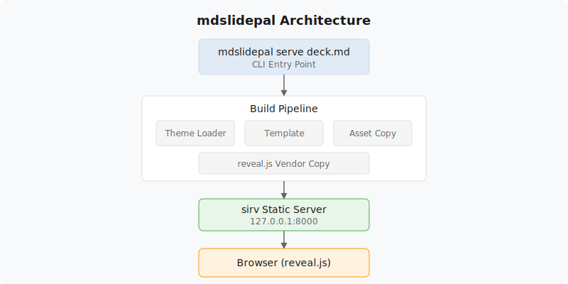
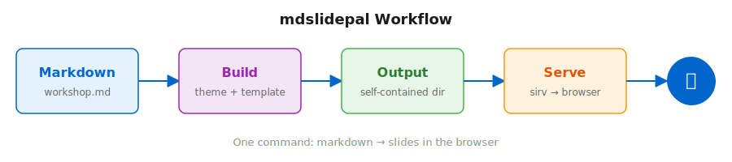
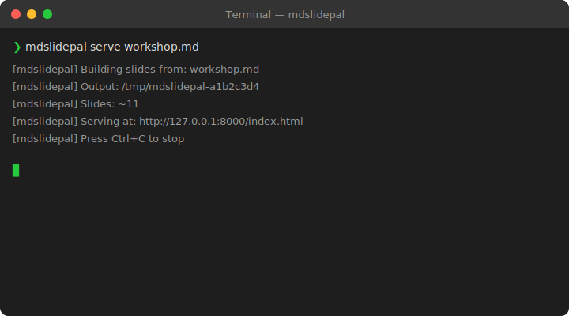

# Image Test Deck

Testing PNG, SVG, and screenshot rendering in mdslidepal

---

# PNG — Logo Image

A raster PNG image, copied from the fixture corpus:


This should render as a visible image, centered on the slide.

---

# SVG — Architecture Diagram

An inline SVG diagram showing the mdslidepal architecture:



SVG should render crisp at any zoom level.

---

# SVG — Workflow Diagram

A horizontal workflow diagram:



This tests wide-aspect SVG rendering within the 16:9 slide canvas.

---

# Screenshot — Terminal Output

A simulated terminal screenshot showing mdslidepal in action:



Screenshots are a common workshop slide element.

---

# Multiple Images on One Slide

Two images side by side (markdown flow — they'll stack vertically):


---

# Image with Code

An image alongside a code block:


```bash
mdslidepal serve workshop.md
# → Opens browser with slides
```

---

# Missing Image Fallback

This references an image that doesn't exist:


The browser should show a broken-image icon with the alt text above.

---

# End

8 slides total — testing PNG, SVG, screenshots, multiple images, mixed content, and missing image fallback.
