# Introduction to AI Augmented Development

### with

### Claude Code

### The Agency · Valueflow

<br><br>

Republic Polytechnic · 13 April 2026

Jordan Dea-Mattson · Principal, The Agency Group AI · CPTO, OrdinaryFolk

---

# How We Got Here

I started experimenting with AI augmented development around **April 2025** — the same time Claude Code appeared.

Everything before that? Honestly, it didn't do much.

Then I started being impressed.

**Christmas 2025** was the inflection point. Claude Code's capabilities jumped. We saw this across the industry.

I did zero-to-one and zero-to-100 exercises. Came away very impressed — but there was **a lot of friction. A lot of pain.**

So I started solving those problems.

That's what became **The Agency** and **Valueflow.**

---

# Who Am I

**Jordan Dea-Mattson** · Almost 4 decades in tech

**Apple** (13 years, 1986–1999)
PM for the 68K Dev Environment (MacsBug, MDS, MPW) · Spoke at 10 WWDCs · Was there the night Steve Jobs came back

**Silicon Valley**
Adobe · Yahoo · Startups (Ooyala, Numenta)

**Singapore**
Indeed · Trade Gecko · Carousell · OrdinaryFolk (CPTO)

**Smart Nation Fellow**

**Advisor:** Open Government Products · StaffAny

My Singaporean hero? Not LKY. **Philip Yeo.**

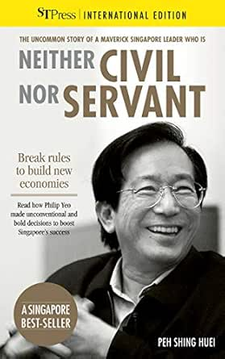

My agentic journey: **12 agents, 2 Agencies, every day.**

---

# My Two Hats

**Hat 1 — The Creator** · The Agency + Valueflow · *Building the methodology*

**Hat 2 — The Practitioner** · CPTO, OrdinaryFolk · *Applying it daily with 12 agents*

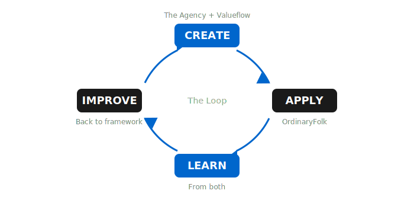

---

# Schedule

| Time | What |
|------|------|
| 09:00–10:00 | Setup |
| 10:00–11:00 | **Part 1:** The Sea Change |
| 11:00–12:00 | **Part 2:** Claude Code |
| 12:00–12:30 | **Part 3:** Valueflow + The Agency |
| 12:30–13:30 | Lunch |
| 13:30–15:00 | **Part 4:** Guided Build |
| 15:00–15:40 | Elevator Pitches |
| 15:40–16:45 | **Part 5:** Independent Build |
| 16:45–17:00 | Show & Tell |

---

# This is NOT Vibe Coding.

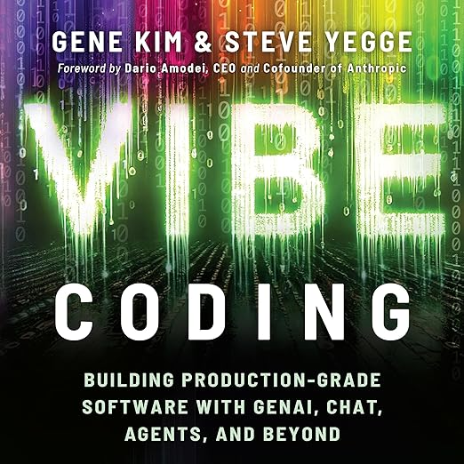

---

# Coding is dead.

---

# We are now all builders.

Execution comes from agents. We are the builders.

---

# The Abstraction Ladder

### As Seen Through My Career

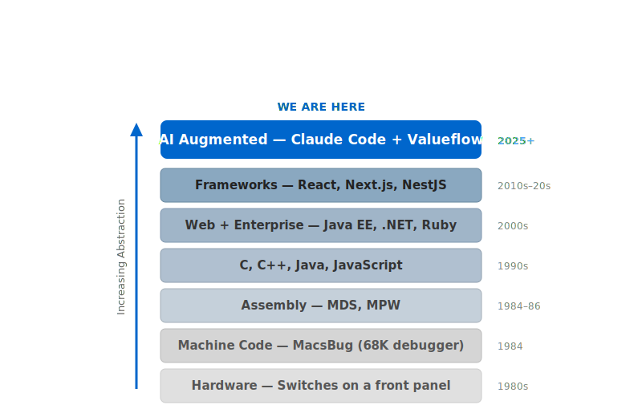

---

# "Asking 'can you code without AI?' is like asking a React developer to write their OS in C."

---

# The Technological Singularity?

You've heard of the technological singularity?

Turns out it's not a single event. It's a **cascade.**

We are in the **software development singularity** right now.

---

# What Distinguishes Great Engineers?

1,926 Microsoft engineers were surveyed. Top 5 attributes:

- Writing good code ← **the only coding skill**
- Adjusting for future value and costs
- Practicing informed decision-making
- Avoiding making others' jobs harder
- Learning continuously

**4 of 5 are NOT coding skills.**

AI is automating #1. The other four are what Valueflow amplifies.

*Li, Ko, Begel. "What Distinguishes Great Software Engineers?" Empirical Software Engineering, Springer, 2019.*

**Question for you:** Which of these five do you teach? Which do you wish you taught more?

---

# A Confession

I'm a **mediocre coder.**

I'd probably fail half the LeetCode problems you throw at me.

But I've been at Apple, Adobe, Indeed, Yahoo — and been successful at every one.

---

# So What Am I Good At?

- Understanding problems and how to break them down
- Seeing how to solve them — not just in code, but structurally
- Building teams and directing them to deliver
- Learning continuously — new domains, new tools, new paradigms

---

# Sound Familiar?

Those are skills **#2 through #5** from the research.

The ones that actually matter. The ones AI doesn't replace.

**I'm top-notch at 4 of the 5.**

And the one I'm mediocre at? AI does it better than me anyway.

---

# What Does a Principal Do All Day?

- **Identify the problem** — scan, notice, catch what others miss
- **Frame it** — give your agents context, goals, constraints
- **Evaluate the output** — is this right? Is this good enough?
- **Decide what's next** — iterate, pivot, ship, or scrap

Every day. Every hour. This loop, over and over.

*A **Principal** is the human in a human-agent collaboration.*

---

# You Might Recognize This Pattern

It's **OODA.**

**Observe** → **Orient** → **Decide** → **Act**

Colonel John Boyd, USAF fighter pilot, 1950s.

"The pilot who cycles through OODA fastest wins the dogfight."

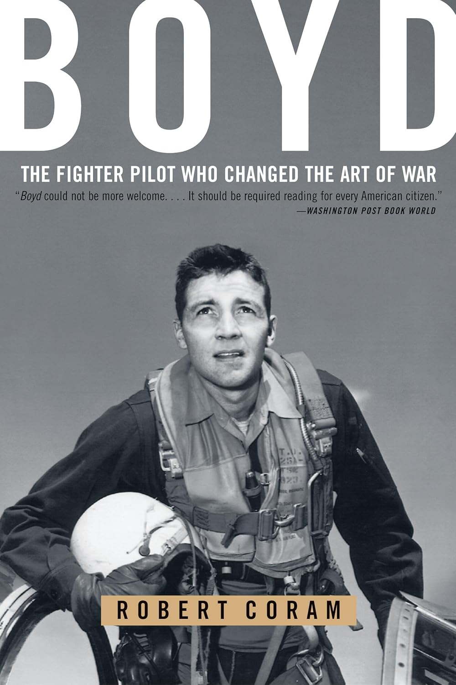

---

# Our Role Is OOD

| | Who |
|---|---|
| **Observe** | The Principal |
| **Orient** | The Principal |
| **Decide** | The Principal |
| **Act** | **The agents** |

Act happens fast with agents. **Gated by OOD and Delegation.**

AI Augmented Development with Valueflow + The Agency lets us **run the OODA loop faster** than anyone.

The Principal drives OOD. The agents execute A.

---

# Fast · Good · Cheap

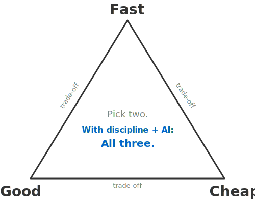

**With discipline and AI augmented development, you can have all three.**

That's the revolution.

---

# Traditionally: Fast + Cheap

People chose Fast and Cheap. They skipped the Good practices.

Test-first · Red-green · Refactoring · Clean code · Code review · Continuous integration · Pair programming · TDD · BDD · Design patterns · SOLID principles · Martin Fowler · Kent Beck · Uncle Bob

All proven. All produce great software.

Many considered **too expensive to scale.**

---

# With AI: All Three

AI gives you **effectively infinitely scalable** execution resources.

Now you CAN do test-first. Now you CAN refactor. Now you CAN review every change — with agents.

The good practices aren't expensive anymore.

**They're free.**

You can have all three.

It's just getting the agents to do it.

---

# Our Quality Philosophy

**We fix things. We don't work around them.**

- No `--no-verify`. No `eslint-disable`. No "fix later."
- Silent failures compound. Workarounds become permanent.
- If a rule matters, it's enforced by a hook — not by prose in a document.

Quality is **mechanical**, not aspirational.

---

# How I Spent My Christmas Vacation

**The challenge:** I wanted to prove to myself I could do it

**The timeline:** Christmas Eve to New Year's Day

**The team:** 7 Claude agents, 14 hours/day

**The cost:** $200/month vs $35K+ for a human team

**The result:** "Landed with dry tanks at 93% utilization"

I didn't know telemedicine. I understood the **problem** and how to break it down.

That system is now being pulled from for design and implementation at OrdinaryFolk.

---

# Domain Fluency + AI

# >

# Either Alone

<br>

The skill that matters: **understanding a problem and how to break it down.**

---

# Career Progression

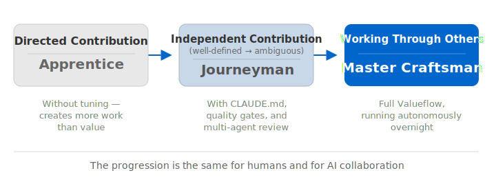

---

# Part 2: Claude Code

## From Anthropic to Agentic Harness

---

# Anthropic — Safety First

- Dario Amodei: VP Research at OpenAI
- Daniela Amodei: VP Safety & Policy at OpenAI
- December 2020: they left. 14 researchers followed.
- Founded Anthropic, 2021

They valued safety.

They went to build safety.

---

# Why Safety Matters to You

**Safety is alignment.**

**Alignment means lower hallucination.**

**Alignment is not something abstract.**

When you trust agents to run overnight, when you trust them with your codebase, when you trust them to ship — alignment is the foundation of that trust.

That's why Claude is the right foundation for serious agent work.

---

# The 4 Ds of AI Fluency

*From Anthropic's AI Fluency research and the Anthropic Academy course*

### Delegation
- Knowing what to hand off and what to keep
- The art of scoping work for an autonomous actor

### Description
- Clearly communicating context, goals, constraints
- "AI can only build what you can describe"

### Discernment
- Evaluating AI output — trust but verify
- Knowing when something is right and when to push back

### Diligence
- You're responsible for what ships
- "AI ate my homework" is not a valid excuse

*Cross-reference: "The 4 Ds of Using AI" — Anthropic (2025). Available at the Anthropic Academy.*

**Question for you:** Which D do your students struggle with most?

---

# What Is a Principal?

**It's the OOD in OODA.**

The human in a human-agent collaboration.

- Sets direction and goals
- Provides context and constraints
- Evaluates output — trust but verify
- Makes the decisions that matter

You already know this role. You've been doing it as educators, as team leads, as professionals.

**In AI Augmented Development, you are the Principal.**

---

# What Is an Agent?

A software entity that can:

- **Perceive** its environment (read files, see errors, receive instructions)
- **Reason** about what to do (plan, evaluate, decide)
- **Act** autonomously (write code, run commands, create artifacts)
- **Persist** across interactions (memory, handoffs, identity)

Not a chatbot. Not autocomplete. An **autonomous actor** with agency.

**It's the A in OODA.**

---

# What Is an Agentic Harness?

The platform that makes agents possible:

- Context management (what the agent knows)
- Tool execution (what the agent can do)
- Lifecycle hooks (when things happen automatically)
- Session persistence (memory across restarts)
- Multi-agent coordination (agents working together)

---

# HX and AX

- **HX** — Human Experience (the Principal's experience)
- **AX** — Agentic Experience (the agent's experience)

Most tools today: great HX, **horrible AX.**

The agent gets no identity, no memory between sessions, no coordination with other agents, constant permission prompts.

The Agency treats both equally. **That's what makes multi-agent work possible.**

---

# What Is Claude Code?

An agentic harness **tuned for building software.**

Boris Cherny at Anthropic needed to build a coding agent. He built it on a generalized agentic foundation, then focused it on the software development use case.

That's why it's extensible — hooks, MCP servers, skills, tools. The coding focus is a layer on a general harness.

---

# What Are Tokens?

The **atoms** of AI communication.

Every word, every symbol, every piece of code is broken into tokens. A token is roughly 3/4 of a word.

- "Hello, world!" ≈ 4 tokens
- A typical email ≈ 200 tokens
- A full source file ≈ 1,000-3,000 tokens

Everything in AI is measured in tokens: what you send, what you receive, what the AI remembers.

---

# Context Window

The AI's **working memory** — measured in tokens.

Everything in the conversation lives here: your instructions, the AI's responses, file contents, tool output, CLAUDE.md.

When it fills up → the AI forgets. That's **compaction.**

"If I asked you to read a 50MB log dump, you'd lose every tree in the forest — and every token in that dump costs money."

---

# Token Economics

Two kinds of tokens. Both cost money.

**Usage tokens** — what you spend each month (your bill)

**Context tokens** — what the AI can hold in working memory (quality)

Burn either one carelessly and you hit limits:
- Streaming command output nobody reads
- Reading entire files when you need one line
- Loading every doc "just in case"

**Discipline = more productive sessions, lower cost, better output.**

The Agency is **parsimonious** with tokens. That's a competitive advantage.

---

# How Do You Tell an Agent How to Do Things?

# CLAUDE.md

**Policy** — standing instructions, project memory, the working agreement.

- `~/.claude/CLAUDE.md` — global (your preferences)
- `./CLAUDE.md` — project root (project rules)
- `./src/CLAUDE.md` — subdirectory (scoped context)

CLAUDE.md is **policy.** Tools and skills are **capability.** Hooks and hookify rules are **enforcement.**

Every lesson learned becomes a standing instruction. **This is where discipline lives.**

---

# The Enforcement Triangle

How do you get AI to do things **the way you want?**

| Layer | What | Why |
|-------|------|-----|
| **CLAUDE.md** | Policy — tells it | Direction |
| **Skills + Tools** | Capability — makes it easy | Discovery |
| **Hooks + Hookify** | Enforcement — forces compliance | Compliance |

"If it's not enforced by code, it's a suggestion."

This is continuous improvement made structural — Deming's Plan-Do-Check-Act, encoded into the tooling.

---

# Agents and Subagents

**Agents** — isolated AI workers with their own context window, system prompt, and tools.

Launch with `claude --agent captain` or `claude --agent devex`. Each agent has identity, memory, and handoffs.

**Subagents** — spawned by the Agent tool for parallel work.

An agent can spin up 4 subagents to review code simultaneously. Each runs in isolation — the parent only sees the summary. The verbose work stays in the subagent's context.

**This is how we scale.** One Principal, many agents, each agent spawning subagents.

---

# Commands, Skills, and Tools

**Tools** — built-in capabilities: Bash · Read · Write · Edit · Grep · Glob · Agent · WebFetch · WebSearch

**Skills** — `/` discoverable recipes for common tasks:

`/define` · `/design` · `/discuss` · `/quality-gate` · `/handoff` · `/commit`

Skills wrap tools into workflows. You type `/`, you see what's available, you pick one.

**Commands** — how you invoke skills. Three kinds: built-in (`/help`, `/compact`), skill-based (your Markdown files), and MCP prompts.

**MCP Servers** — extend capabilities beyond the built-in tools (browser, databases, APIs, Figma).

---

# Events and Hooks

**Events** — lifecycle moments in a Claude Code session:

`SessionStart` · `Stop` · `PreToolUse` · `PostToolUse` · `Notification`

**Hooks** — automation that fires at those events:

- On `SessionStart` → read your handoff, check for dispatches, sync with master
- On `PreToolUse` → enforce rules before the agent acts
- On `Stop` → warn about uncommitted work

**Hookify rules** — the enforcement layer. Block dangerous patterns, warn on risky ones, point to the right skill.

This is the third side of the Enforcement Triangle: **forced compliance.**

---

# Lifecycle of a Claude Code Session

1. **Session Resume** — sync with master, read handoff, check dispatches
2. **Dialogue** — discuss, plan, get direction from the Principal
3. **Execute** — implement through phases and iterations, QG at every boundary
4. **Compact** — context fills up, the AI summarizes and continues (plan for this)
5. **Session End** — write handoff, commit work, report readiness

Each session picks up where the last one left off. **Handoffs are the bridge.**

---

# Jamon Holmgren's 8 Practices

- ✅ Excellent test suite
- ✅ Excellent docs
- ✅ Curated codebase
- ✅ Review agents
- ✅ Well-written specs
- ~~Review every line of every change~~
  - **We use Quality Gates + Multi-Agent Review**
- ✅ **Run agents at night** ← the discipline test
- ✅ Hand-write features sometimes

"If your system can't run autonomously while you sleep, your docs, tests, and specs aren't good enough yet."

---

# Part 3: Valueflow + The Agency

## The AI ADLC

---

# The Problem

All existing SDLCs were designed for a **non-agentic world.**

Nobody has reimagined the development lifecycle for human-agent collaboration.

---

# A Lot Has Been Written About Shipping Faster

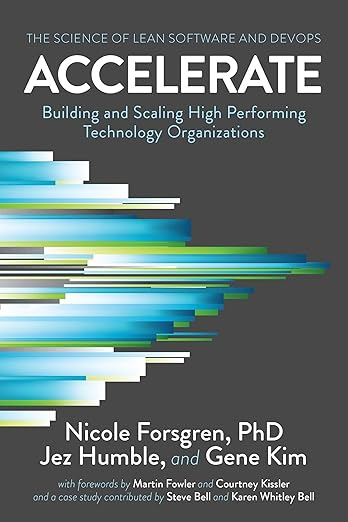 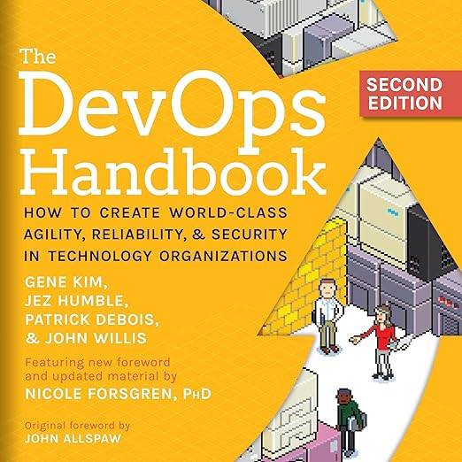 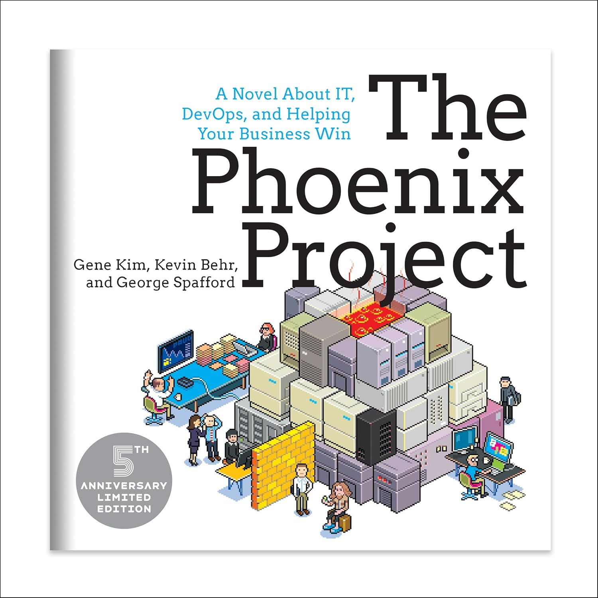 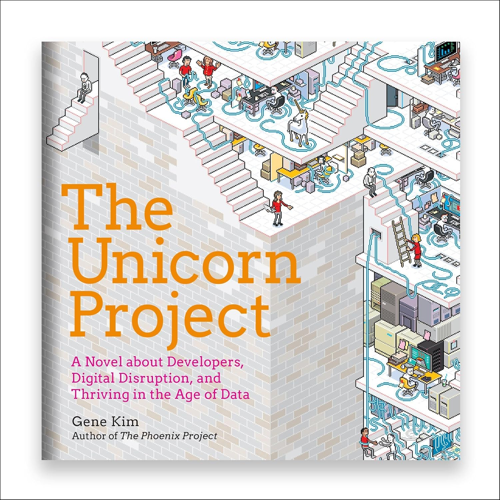

All brilliant. All about **code commit → customer hands.**

---

# The Research That Exists

**Nicole Forsgren** + DORA (2014–2025, 39,000+ professionals)

Proved: software delivery performance is **measurable** and predicts organizational outcomes.

**Four Key Metrics:** deployment frequency, lead time, change failure rate, MTTR

But these measure **code commit → production.**

---

# The Gap Nobody Filled

**Upstream** (idea → code): ideation, research, requirements, design, planning — **unmeasured**

**Downstream** (production → value): adoption, feedback, value realization — **unmeasured**

**Agentic**: multi-agent coordination, human-agent workflows, agent quality gates — **not addressed**

Forsgren measured half the problem. **Valueflow measures all of it.**

*Forsgren, Humble, Kim. "Accelerate." IT Revolution, 2018.*

---

# Valueflow — The AI ADLC

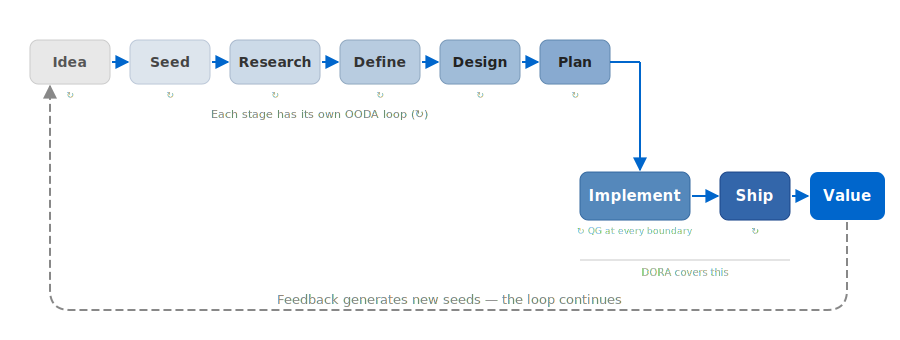

The first methodology for **structured human-agent collaborative development.**

Valueflow is the process. The Agency is the tooling that enables it.

---

# Seed → Define

**Seed** — a captured starting point. A conversation, a document, an observation, a flag.

*"I want to build a personal page with a mini-blog."* ← That's a seed.

**Define** — Product Vision & Requirements (PVR). The *what* and *why*.

- What are we building?
- Who is it for?
- What does success look like?

**Artifact: PVR** — the living requirements document.

---

# Design → Plan

**Design** — Architecture & Design (A&D). The *how* and *why*.

- Technology choices and rationale
- Component architecture
- Trade-offs considered and decided

**Artifact: A&D** — the living design document.

**Plan** — Phases × Iterations. The execution roadmap.

- Phase 1: scaffold + core
- Phase 2: features
- Phase 3: polish + ship

**Artifact: The Plan** — updated after every commit.

---

# Implement → Ship → Value

**Implement** — agents execute autonomously. Quality Gate at every iteration boundary.

**Ship** — Captain merges, builds PRs, pushes. Pre-ship quality gate.

**Value** — in the customer's hands. Feedback generates new seeds — the loop continues.

**Artifacts at Implement:**
- **Quality Gate Report (QGR)** — multi-agent review, findings, fixes, test results
- Every commit boundary has a QGR receipt — the audit trail

---

# Quality Gates — The 8 Stages

Every commit boundary runs this protocol:

1. **Parallel review** — 4+ specialized agents (code, security, design, test) review simultaneously
2. **Score and consolidate** — scorer agent rates findings 0–100, filter noise, deduplicate
3. **Bug-exposing tests** — write tests that expose each issue, confirm they **fail** (red)
4. **Fix issues** — fix each issue, confirm the test now **passes** (green). Red→green = proof.
5. **Coverage review** — identify gaps from test reviewer findings
6. **Add coverage tests** — edge cases, error paths, integration boundaries
7. **Fix new issues** — if new tests expose problems, fix them
8. **Confirm all clean** — lint, format, typecheck, all tests pass. **Failing = 0.**

The result: a **Quality Gate Report (QGR)** — the proof that the gate ran.

**Agents review agents.** This is how we scale quality.

---

# The Multi-Agent Dimension

This is NOT you and one AI assistant.

- You as a **Principal** running an **Agency** — 12 agents in parallel
- Each agent: identity, memory, handoffs, quality gates
- Agents review each other, test each other
- Your Agency collaborates with **other Agencies** run by other humans
- "I run my Agency. And I collaborate with other Agencies."

---

# Agents Talk to Each Other

Not just you talking to agents. **Agents collaborate with agents.**

- Agents **delegate work** via dispatches (structured messages in git)
- Agents **review each other's output** (Multi-Agent Review)
- Agents **report bugs** — and other agents fix them
- Agents **escalate** when something needs the Principal's attention

**Dispatches** — structured messages: directive, review, seed, escalation. Instant notification via ISCP. Agents check automatically on session start. No human routing.

**Flags** — quick observations captured for later. Zero friction.

---

# Today's Example

An agent filed a bug. Another agent fixed it. **Autonomously.**

**DesignEx agent** (running autonomously) hit a bug in `agency update`. It **filed the bug and escalated to Captain** via dispatch.

Captain **diagnosed and fixed** the bug in 5 minutes.

Captain **dispatched the fix** to monofolk (a different Agency).

Bug found by one agent. Fixed by another. Delivered to a third Agency.

**No human had to discover the bug.** No human had to assign the fix.

---

# Claude Code Alone vs The Agency

| | Claude Code | + The Agency |
|---|---|---|
| Start | Empty directory | Empty directory |
| After `git init` | `.git/` | `.git/` |
| After setup | `.claude/` | `.claude/` + `claude/` + `usr/` + `CLAUDE.md` |
| **First run** | Blank canvas | Hooks fire, handoff read, enforcement active |
| **Result** | Smart assistant | **Structured methodology** |

---

# What You Get — The Repo Structure

```
my-project/
├── CLAUDE.md              — project instructions
├── claude/                — framework
│   ├── tools/             — 60+ CLI tools
│   ├── agents/            — agent class definitions
│   ├── docs/              — reference docs
│   ├── hooks/             — session lifecycle hooks
│   ├── hookify/           — behavioral rules (warn/block)
│   ├── config/            — agency.yaml, settings template
│   └── workstreams/       — bodies of work
├── .claude/
│   ├── settings.json      — permissions, hooks config
│   ├── skills/            — /define, /discuss, /commit...
│   └── agents/            — captain.md, devex.md...
└── usr/
    └── jordan/
        └── captain/       — handoffs, dispatches, transcripts
```

One `agency init` and you have a structured methodology.

---

# Multi-Agent Review (MAR)

The review loop that runs at every quality gate:

1. **Captain dispatches** the work to 4+ review agents in parallel
2. Each agent reviews from a different lens (code, security, design, test)
3. **Scorer consolidates** — rates findings 0–100, deduplicates
4. Author agent **triages** into three buckets: Disagree, Autonomous, Collaborative
5. **Fixes** with red→green test cycle — proof, not assertion
6. **QGR receipt** — the permanent audit trail

MAR replaces human code review. It's parallel, mechanical, and **scales infinitely.**

---

# The Agency — The Platform

**The Agency** enables Valueflow.

- 60+ tools
- Quality gates at every boundary
- Multi-agent coordination
- Session continuity (handoffs, ISCP)
- Enforcement (Triangle: tool + skill + hookify rule)

**This afternoon, you'll use it.**

---

# Lunch

Back at 13:30.

---

# Part 4: Guided Build

## Seed to Deploy

---

# Before We Start — Checklist

- ✅ Claude Code installed and running (`claude --version`)
- ✅ GitHub account logged in
- ✅ Workshop repo cloned
- ✅ Terminal open in the project directory

**If you're stuck, raise your hand.** We'll get you sorted before we begin.

---

# The Toy Project

**Personal page + mini-blog → deployed to Vercel**

- About me section
- Mini-blog with 2–3 posts
- Next.js + Tailwind + markdown
- **From idea to live URL in 90 minutes**

---

# Step 1: The Seed

Tell your Captain:

"I want to build a personal page with a mini-blog. Here's my name and a sentence about me."

Start with `/discuss` and `/transcript` — capture the conversation.

---

# Step 2: Define (PVR)

Run `/define` — your Captain guides you through requirements.

- What pages?
- What features?
- What does success look like?

**Valueflow phase: Define.** Artifact: Product Vision & Requirements (PVR).

**This is Description from the 4 Ds.**

---

# Step 3: Design (A&D)

Run `/design` — Captain proposes: Next.js, Tailwind, markdown files.

You review. You ask why.

**Valueflow phase: Design.** Artifact: Architecture & Design (A&D).

**This is Discernment.**

---

# Step 4: Plan

Captain breaks it into iterations:

- Project scaffold + about page
- Blog listing + individual posts
- Styling and polish
- Vercel deploy
- (Stretch) AI Q&A section

Use **Plan Mode** — think before you act.

**Valueflow phase: Plan.** Artifact: The Plan (phases × iterations).

---

# Step 5: Build

Captain executes. You watch and review.

"If something looks wrong, hit Escape and ask why."

After each iteration: review → approve → next.

**This is the OODA loop.**

---

# Step 6: Deploy

- Sign up for Vercel (free)
- Connect GitHub repo
- Captain handles the config
- **You have a live URL**

---

# 🎉

You just went from idea to deployed website through a structured methodology in 90 minutes.

Share your URL!

---

# Elevator Pitches

2 minutes each.

**"I want to build [X] because [Y]."**

---

# Independent Build

Your idea. Your Captain. Valueflow.

Jordan floats — ask for help anytime.

Goal: running locally, ideally deployed.

---

# Remember the Loop

You just experienced Valueflow:

**Seed** (your idea) → **Define** (PVR) → **Design** (A&D) → **Plan** → **Implement** → **Ship** → **Value**

Quality Gates at every boundary. OODA at every stage.

Now do it again — on your own project.

---

# Show & Tell

Volunteers: demo what you built.

---

# A Call to Action — ~~For Educators~~ For Everyone

You are the people who shape what the next generation learns.

**Reorient education around OODA.**

- Teach **Observe** — problem identification, critical analysis, pattern recognition
- Teach **Orient** — framing problems, communicating context, giving clear direction
- Teach **Decide** — evaluating output, judgment, when to trust and when to question
- Teach **Act through Delegation** — packaging work, assigning it, coordinating agents

The Principal IS the OOD. **Act is now Delegation.**

Don't teach coding as the core skill. **AI does the execution.**

Teach your students to be **great Principals** — not great coders.

---

# What's Next — Markdown is the Lingua Franca

Not .doc. Not .pptx. Not Google Docs.

**Markdown.**

It's what agents read. It's what agents write. It's what survives compaction, handoffs, and version control.

Every tool we build is markdown-native.

---

# The Ecosystem

- **Markdown Pal** — reviewing and navigating markdown (macOS + iOS)
- **mdslidepal** — presenting from markdown (these slides!)
- **Mock and Mark** — visual communication for markdown-native workflows

All built with Claude Code. All built with Valueflow. All open source.

---

# How I Actually Work

- **Over/Over-and-Out** — radio protocol for structured agent conversation (adapted from 1860s Morse telegraphy)
- **Multi-Agency** — Principal on two Agencies (The Agency + OrdinaryFolk) simultaneously, every day
- **Voice-first** — Granola for meetings, Remote Control for mobile. These slides were built over several days via breakfast walks, dictation, and three Granola review passes fed to multi-agent review.

---

# Key Takeaways

- **This is NOT Vibe Coding** — it's engineering
- **Context is everything** — manage it or lose it
- **Description drives quality** — AI builds what you describe
- **Trust but verify** — apprentice to master
- **Quality gates matter** — agents review agents
- **You are builders** — the abstraction continues

---

# Diligence Disclosure

In keeping with the Fourth D:

**The Agency** was built entirely with Claude Code — every tool, every skill, every hookify rule, every line of framework code.

**Valueflow** was designed through structured human-agent collaboration — seeds, PVRs, A&Ds, plans, all produced via the methodology itself.

**This workshop** — the outline, the research, the slides, the deck tool (mdslidepal) — was built using Claude Code, The Agency, and Valueflow.

We are responsible for what we ship. And we disclose how it was made.

---

# Acknowledgments

**Mr Abel Ang**
Chairperson, Republic Polytechnic
*For recommending me to the SOI Advisory Committee. Without him, this wouldn't be happening.*

**Ms Wong Wai Ling**
Director, School of Infocomm (SOI), Republic Polytechnic
*For taking a risk on this workshop and making it a reality.*

**Ms Phyllis Ling**
Manager (Admin), Republic Polytechnic
*For her help with logistics.*

**Anthropic and the Claude AI team**
*For building the foundation this is all built on.*

And anyone else I might have missed — thank you.

---

# Built with What We Taught You

Everything you experienced today was built using the tools and methodology we just showed you:

- **These slides** → built with **mdslidepal** (written yesterday, first use today)
- **The workshop outline** → planned using **Valueflow** (Seed → PVR → Plan)
- **The research** → run by **parallel agents** (4 agents, background)
- **The content review** → via **Over/Over-and-Out protocol** (voice input, breakfast walk, Remote Control)
- **All of it** → **Claude Code + The Agency + Valueflow**

We practice what we preach.

---

# Thank You

- **Web:** the-agency-group.ai
- **GitHub:** github.com/the-agency-ai/the-agency
- **X:** @AgencyGroupAI

Jordan Dea-Mattson · jdm@devopspm.com · GitHub: jordandm
